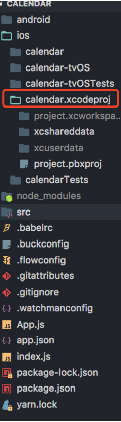

# calendar
日历APP

React Native官网：https://reactnative.cn/

## 项目运行步骤（Xcode上运行）

1. git clone https://github.com/webpig/calendar.git

2. cd calendar

3. npm install

4. 直接使用Xcode打开项目中ios文件夹下的calendar.xcodeproj

详情见文档：https://reactnative.cn/docs/getting-started/

### 运行效果：

## 真机调试

具体见链接：https://segmentfault.com/a/1190000014416132
